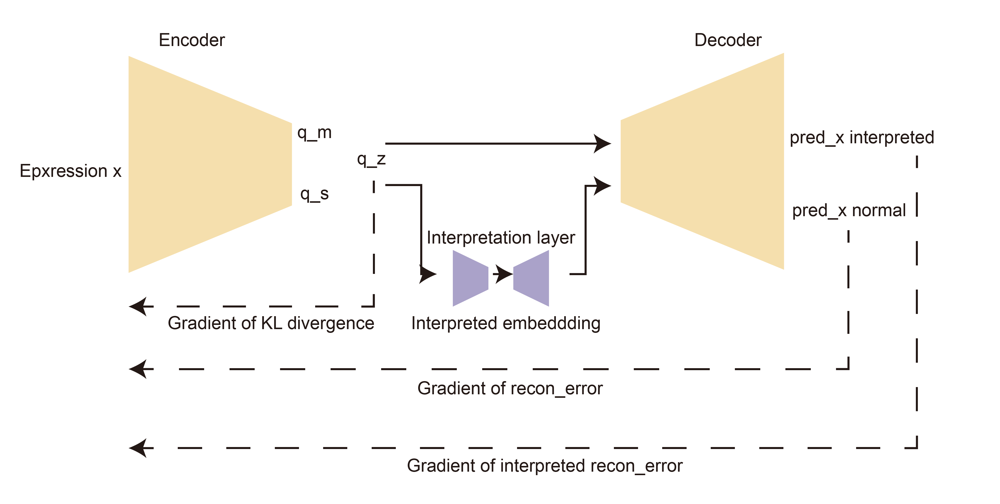

iVAE is an enhanced representation learning method designed for capturing lineage features and gene expression patterns in single-cell transcriptomics. Compared to a standard VAE, iVAE incorporates a pivotal interpretative module that increases the correlation between latent components. This enhanced correlation helps the model learn gene expression patterns in single-cell data where correlations are present.

