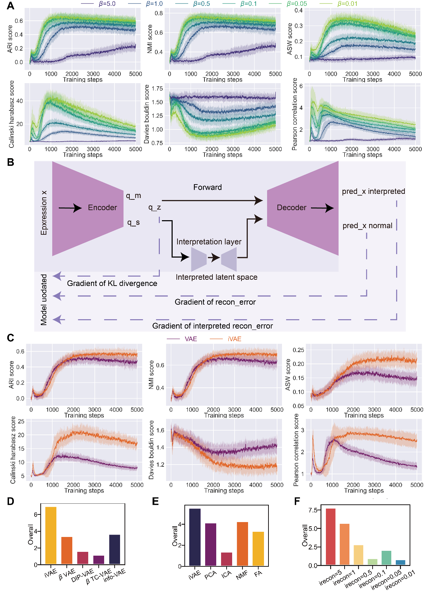

iVAE documentation
==================

iVAE is an enhanced representation learning method designed for capturing lineage features and gene expression patterns in single-cell transcriptomics. Compared to a standard VAE, iVAE incorporates a pivotal interpretative module that increases the correlation between latent components. This enhanced correlation helps the model learn gene expression patterns in single-cell data where correlations are present.

Key Features
------------

- **Interpretative Module**: A bottleneck layer that compresses and reconstructs the latent space, revealing correlated gene expression patterns
- **Multiple Regularizers**: Supports beta-VAE, DIP-VAE, beta-TC-VAE, and InfoVAE loss formulations
- **Single-Cell Optimized**: Uses negative binomial likelihood for count data and learnable dispersion
- **Easy to Use**: Both Python API and command-line interface
- **GPU Accelerated**: Automatic CUDA detection for fast training

Installation
------------

.. image:: https://img.shields.io/pypi/v/iVAE.svg?color=brightgreen&style=flat
   :target: https://pypi.org/project/iVAE/

.. code-block:: bash

   pip install iVAE

This repository is hosted at `iVAE GitHub Repository <https://github.com/PeterPonyu/iVAE>`_.

Quick Start (Python API)
------------------------

.. code-block:: python

   import scanpy as sc
   import iVAE

   # Load your single-cell data
   adata = sc.read_h5ad('data.h5ad')

   # Initialize and train iVAE
   model = iVAE.agent(
       adata,
       layer='counts',
       latent_dim=10,
       i_dim=2,
       irecon=1.0,
       beta=1.0,
       epochs=1000
   ).fit()

   # Extract representations
   iembed = model.get_iembed()   # Interpretative embedding (n_cells x i_dim)
   latent = model.get_latent()   # Full latent space (n_cells x latent_dim)

   # Add to AnnData for downstream analysis
   adata.obsm['X_iVAE'] = iembed
   adata.obsm['X_latent'] = latent

Quick Start (Command Line)
--------------------------

.. code-block:: bash

   iVAE --epochs 1000 --layer counts --irecon 1.0 --data_path data.h5ad --output_dir iVAE_output

CLI Parameters
--------------

- ``--epochs``: Number of training epochs (default: 1000)
- ``--layer``: Layer to use from the AnnData object (default: 'counts')
- ``--percent``: Fraction of cells per mini-batch (default: 0.01)
- ``--irecon``: Interpretative reconstruction loss weight (default: 0.0)
- ``--beta``: KL divergence weight (default: 1.0)
- ``--dip``: DIP loss weight (default: 0.0)
- ``--tc``: Total correlation loss weight (default: 0.0)
- ``--info``: InfoVAE MMD loss weight (default: 0.0)
- ``--hidden_dim``: Hidden layer dimension (default: 128)
- ``--latent_dim``: Latent space dimension (default: 10)
- ``--i_dim``: Interpretative dimension (default: 2)
- ``--lr``: Learning rate (default: 1e-4)
- ``--data_path``: Path to input h5ad file (default: 'data.h5ad')
- ``--output_dir``: Output directory (default: 'iVAE_output')

Output Files
------------

After training, the following files are saved to the output directory:

- ``iembed.npy``: Interpretative embedding from ``get_iembed()``
- ``latent.npy``: Full latent representation from ``get_latent()``

.. code-block:: python

   import numpy as np
   iembed = np.load('iVAE_output/iembed.npy')
   latent = np.load('iVAE_output/latent.npy')

Advanced Usage
--------------

**DIP-VAE regularization** (disentangled latent factors):

.. code-block:: python

   model = iVAE.agent(adata, layer='counts', dip=10.0, irecon=1.0).fit()

**Beta-TC-VAE** (total correlation decomposition):

.. code-block:: python

   model = iVAE.agent(adata, layer='counts', tc=5.0, irecon=1.0).fit()

**InfoVAE** (MMD-based regularization):

.. code-block:: python

   model = iVAE.agent(adata, layer='counts', info=1.0, irecon=1.0).fit()

License
-------

.. image:: https://img.shields.io/github/license/PeterPonyu/iVAE?style=flat-square&color=brightgreen
   :target: https://choosealicense.com/licenses/mit/

This project is licensed under the MIT License.

Citation
--------

Fu, Z., Chen, C., Wang, S., Wang, J., & Chen, S. (2025).
iVAE: Interpretable Variational Autoencoder for Enhancing Clustering and
Revealing Latent Biological Structure in Single-Cell Transcriptomics.
*BMC Biology*.
`doi:10.1186/s12915-025-02315-7 <https://doi.org/10.1186/s12915-025-02315-7>`_

Contact
-------

For questions or issues, please contact Zeyu Fu at `fuzeyu99@126.com <mailto:fuzeyu99@126.com>`_.

.. toctree::
   :maxdepth: 2
   :hidden:
   :caption: API

   agent
   model
   module
   environment
   mixin
   utils
